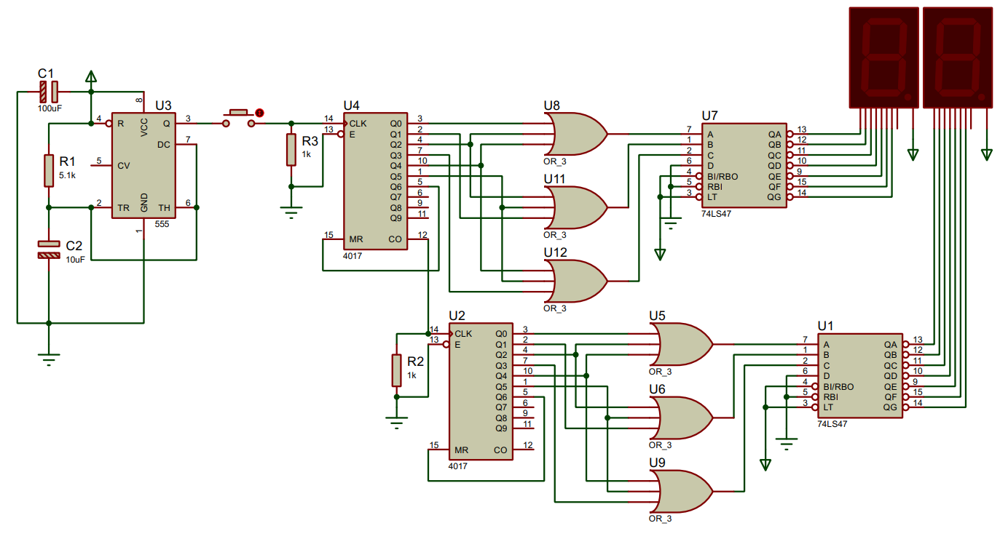
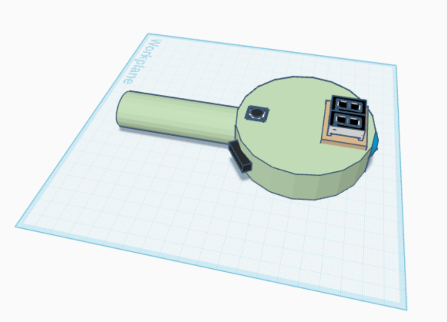
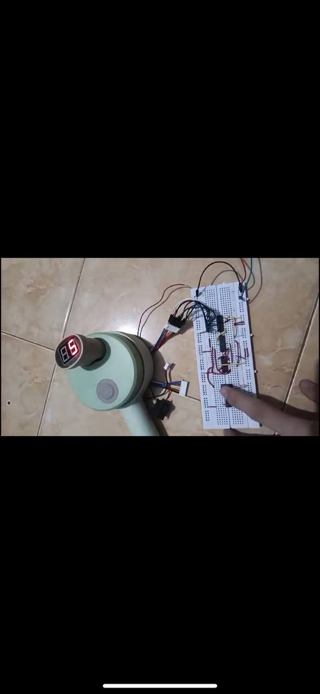
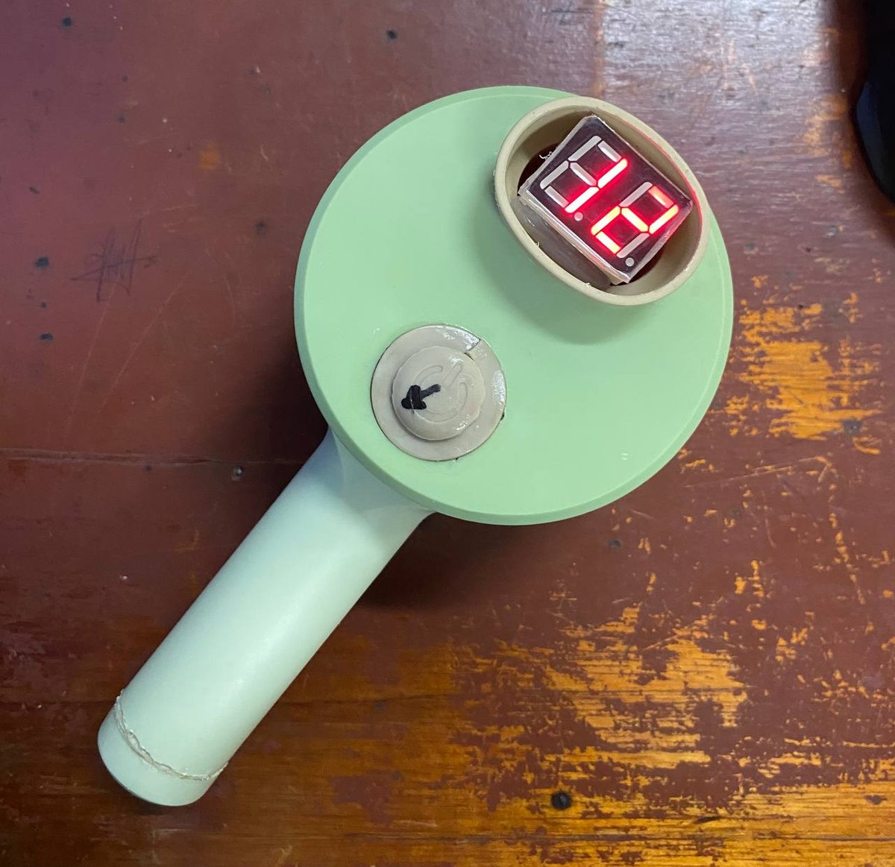

# Digital-Dice-Dual-Seven-Segment-Asynchronous-Spin

**Two independent d6 dice built entirely from discrete logic. No microcontroller, no firmware, no code in the signal path.**

A CD4017 decade counter is folded into a mod-6 sequencer, and exactly three OR gates translate its one-hot output into the BCD that a 74LS47 expects, so the digits 0, 7, 8 and 9 are not filtered out in software, they are *structurally unreachable*.


</div>

---

## The core idea

A dice shows 1 through 6. A CD4017 counts 0 through 9. A 74LS47 speaks BCD. Bridging those three facts is the whole design problem, and the interesting part is how cheaply it can be done.

Two constraints have to be satisfied at once:

1. **The count must wrap after six states.** Solved by feeding `Q6` back into the counter's own Master Reset. The instant the seventh state would appear, it erases itself — a glitch tens of nanoseconds wide that the display never resolves.

2. **Each one-hot output must become a BCD number.** The CD4017 asserts exactly one of `Q0..Q5` at a time. The 74LS47 wants a 4-bit weighted code. Writing out the binary expansion of the six target digits makes the answer fall out:

| Digit | D (8) | C (4) | B (2) | A (1) |
|:-----:|:-----:|:-----:|:-----:|:-----:|
| 1 | 0 | 0 | 0 | **1** |
| 2 | 0 | 0 | **1** | 0 |
| 3 | 0 | 0 | **1** | **1** |
| 4 | 0 | **1** | 0 | 0 |
| 5 | 0 | **1** | 0 | **1** |
| 6 | 0 | **1** | **1** | 0 |

Read the table by **column** instead of by row and the logic writes itself:

```
A = Q0 + Q2 + Q4        (bit 1 is set for digits 1, 3, 5)
B = Q1 + Q2 + Q5        (bit 2 is set for digits 2, 3, 6)
C = Q3 + Q4 + Q5        (bit 4 is set for digits 4, 5, 6)
D = GND                 (bit 8 is never set below 8)
```

Three OR terms, three inputs each. A CD4075 contains **three 3-input OR gates in one package** — the requirement and the part match with nothing left over and nothing missing.

That last point is what makes the design worth showing. `D` is not merely unused; it is tied to ground. Digits 8 and 9 have no electrical path to the display at all. And because `Q6` never survives long enough to be decoded, neither do 0 or 7. The rule "a dice shows 1 to 6" is enforced by the topology of the board, not by a condition that could be got wrong.

---

## How it works

<div align="center">

</div>

The signal path per channel:

```
  NE555          CD4017           CD4075          74LS47        7-segment
 astable  --->  decade    --->   3 x OR_3  --->  BCD to    --->  common
  clock         counter          mapping         7-seg          anode
                   |                              |
                   +-- Q6 -> MR                   +-- D tied to GND
                       (mod-6 fold)                   (8 and 9 impossible)
```

**Stage 1 — NE555 astable.** Free-running square wave. The frequency sets how fast the digits cycle, and therefore whether the display reads as a spin or a count.

**Stage 2 — CD4017.** Advances one output per rising clock edge. Note that its decoded outputs are *not* in pin order — `Q5` is on pin 1, `Q0` is on pin 3. This is the single most common wiring error on this build.

**Stage 3 — CD4075.** The three OR gates derived above. Purely combinational; no clock, no state.

**Stage 4 — 74LS47.** BCD in, seven segment lines out. Its outputs are **active LOW**, which is why the display must be **common anode** — a LOW output sinks current through the segment. Fitting a common-cathode display here produces an inverted, meaningless pattern.

**Stage 5 — Display.** Series resistors on every segment line. Not optional.

---

## Timing and the two spin rates

Both channels use the standard NE555 astable, so the clock period is

$$f = \frac{1.44}{(R_1 + 2R_2)\,C}$$

and one displayed digit lasts exactly one clock period, regardless of duty cycle — the CD4017 only cares about rising edges.

Only the timing capacitor differs between channels:

| Channel | C | Frequency | One digit | Full 1→6 cycle | Reads as |
|---|---|---|---|---|---|
| 1 (fast) | 10 µF | 9.43 Hz | 106 ms | 636 ms | fast flicker |
| 2 (slow) | 100 µF | 0.94 Hz | 1.06 s | 6.36 s | visible count |

A 10× ratio, which is exactly the point: the two displays are never in phase, so stopping them yields two genuinely independent results rather than the same face twice.


> [!TIP]
> At 9.4 Hz the "fast" channel flickers rather than blurs — a player can still track individual digits and time the button press. Persistence of vision needs roughly **20 Hz or more** before the digit becomes genuinely unreadable. Dropping C to **1–2.2 µF** moves the fast channel to 42–94 Hz and makes the spin feel honest.

---

# Datasheets

Manufacturer datasheets for every active component. Links rather than local
copies, since manufacturers revise them and a stale PDF is worse than none.

| Part | Function | Datasheet |
|---|---|---|
| NE555 | Timer, astable clock source | [TI SNAS548](https://www.ti.com/lit/ds/symlink/ne555.pdf) |
| CD4017B | CMOS decade counter, 10 decoded outputs | [TI CD4017B](https://www.ti.com/lit/ds/symlink/cd4017b.pdf) |
| CD4075B | CMOS triple 3-input OR gate | [TI CD4075B](https://www.ti.com/lit/ds/symlink/cd4075b.pdf) |
| SN74LS47 | BCD to seven-segment decoder/driver | [TI SN5447A](https://www.ti.com/lit/ds/symlink/sn5447a.pdf) |

## Absolute maximum ratings

Worth reading once, because it settles the supply-voltage question:

| Part | Supply range | Absolute max |
|---|---|---|
| NE555 | 4.5 – 16 V | 18 V |
| CD4017 | 3 – 15 V | 18 V |
| CD4075 | 3 – 15 V | 18 V |
| **74LS47** | **4.75 – 5.25 V** | **7 V** |
---

## Gallery

<div align="center">

<table>
<tr>
<td width="33%"></td>
<td width="33%"></td>
<td width="33%"></td>
</tr>
</table>

---

## About

Final project for **Digital Electronics**, semester 3, Electronics Engineering Study Program, Department of Electrical Engineering, **Politeknik Negeri Sriwijaya**, Palembang 2024
