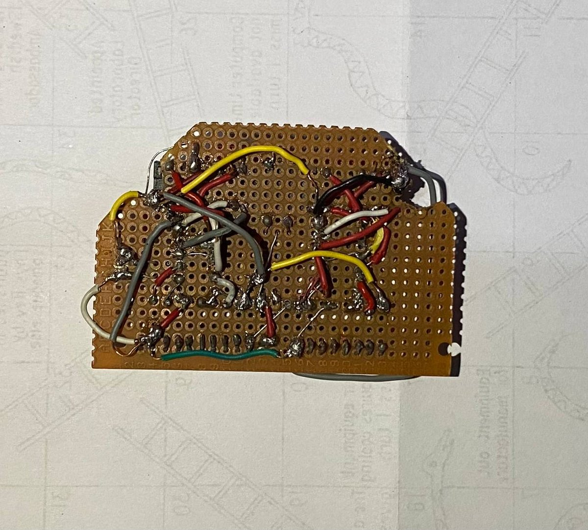
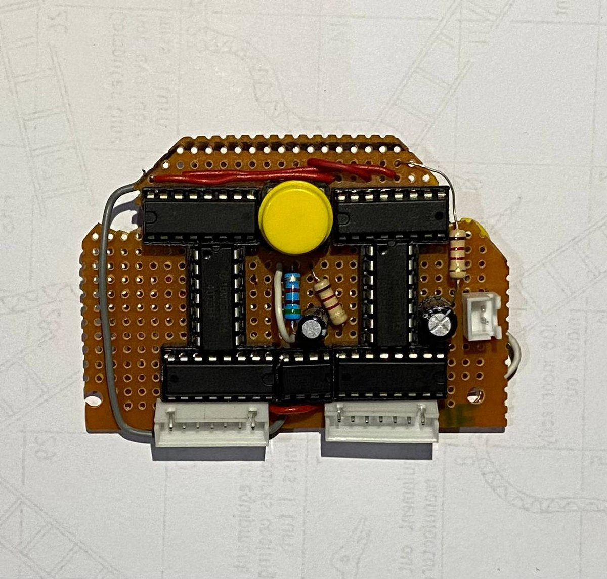
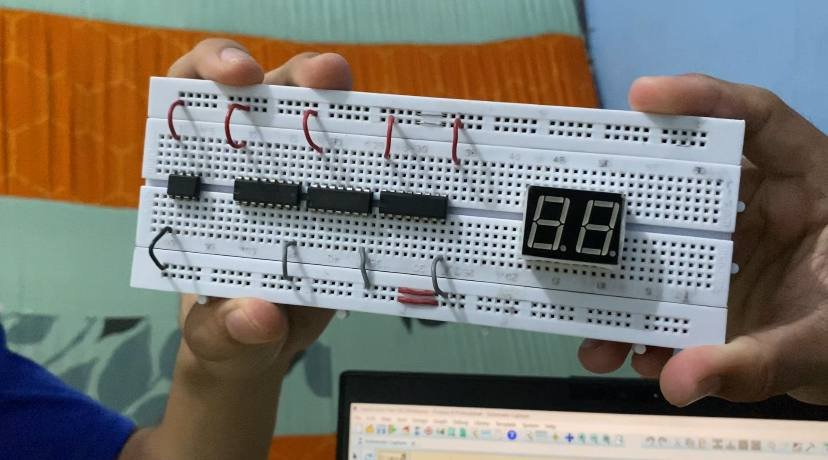
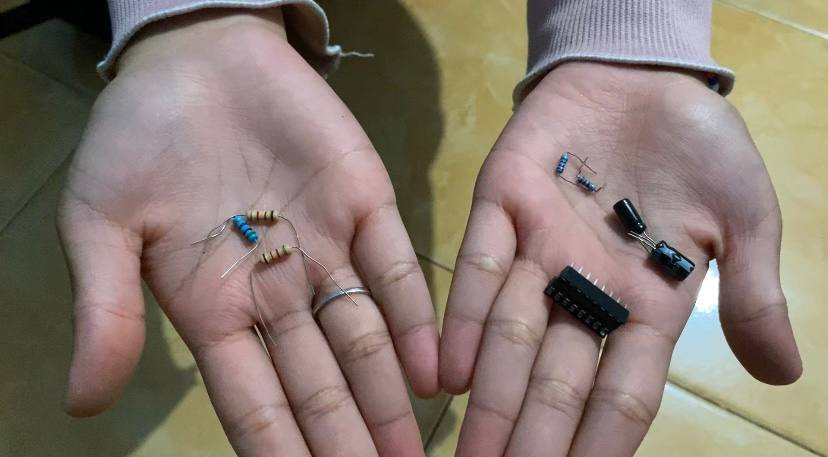

<div align="center">

  # Digital-Dice|Dual-Seven-Segment|Asynchronous-Spin

**Two independent d6 dice built entirely from discrete logic. No microcontroller, no firmware, no code in the signal path.**

A CD4017 decade counter is folded into a mod-6 sequencer, and exactly three OR gates translate its one-hot output into the BCD that a 74LS47 expects — so the digits 0, 7, 8 and 9 are not filtered out in software, they are *structurally unreachable*.

[](#verification)
[](#the-core-idea)
[](#design-philosophy)
[](#about)
[](LICENSE)



*Politeknik Negeri Sriwijaya · Electrical Engineering · Semester 3 Project · 2024*

**[Bahasa Indonesia →](README.id.md)**

</div>

---

## Table of Contents

- [The core idea](#the-core-idea)
- [Design philosophy](#design-philosophy)
- [How it works](#how-it-works)
- [Verification](#verification)
- [Timing and the two spin rates](#timing-and-the-two-spin-rates)
- [Bill of materials](#bill-of-materials)
- [Repository layout](#repository-layout)
- [Getting started](#getting-started)
- [Gallery](#gallery)
- [Known limitations](#known-limitations)
- [Documentation](#documentation)
- [About](#about)
- [Authors](#authors)

---

## The core idea

A dice shows 1 through 6. A CD4017 counts 0 through 9. A 74LS47 speaks BCD. Bridging those three facts is the whole design problem, and the interesting part is how cheaply it can be done.

Two constraints have to be satisfied at once:

1. **The count must wrap after six states.** Solved by feeding `Q6` back into the counter's own Master Reset. The instant the seventh state would appear, it erases itself — a glitch tens of nanoseconds wide that the display never resolves.

2. **Each one-hot output must become a BCD number.** The CD4017 asserts exactly one of `Q0..Q5` at a time. The 74LS47 wants a 4-bit weighted code. Writing out the binary expansion of the six target digits makes the answer fall out:

| Digit | D (8) | C (4) | B (2) | A (1) |
|:-----:|:-----:|:-----:|:-----:|:-----:|
| 1 | 0 | 0 | 0 | **1** |
| 2 | 0 | 0 | **1** | 0 |
| 3 | 0 | 0 | **1** | **1** |
| 4 | 0 | **1** | 0 | 0 |
| 5 | 0 | **1** | 0 | **1** |
| 6 | 0 | **1** | **1** | 0 |

Read the table by **column** instead of by row and the logic writes itself:

```
A = Q0 + Q2 + Q4        (bit 1 is set for digits 1, 3, 5)
B = Q1 + Q2 + Q5        (bit 2 is set for digits 2, 3, 6)
C = Q3 + Q4 + Q5        (bit 4 is set for digits 4, 5, 6)
D = GND                 (bit 8 is never set below 8)
```

Three OR terms, three inputs each. A CD4075 contains **three 3-input OR gates in one package** — the requirement and the part match with nothing left over and nothing missing.

That last point is what makes the design worth showing. `D` is not merely unused; it is tied to ground. Digits 8 and 9 have no electrical path to the display at all. And because `Q6` never survives long enough to be decoded, neither do 0 or 7. The rule "a dice shows 1 to 6" is enforced by the topology of the board, not by a condition that could be got wrong.

> [!NOTE]
> A microcontroller version of this project is roughly four lines of code. That version can also print `7` if the modulo is written wrong. This one cannot — and demonstrating that difference is the point of the exercise.

---

## Design philosophy

| Decision | Reasoning |
|---|---|
| **No microcontroller** | The course is Digital Electronics. Hiding the state machine inside firmware would hide the entire subject being assessed. |
| **CD4017 + CD4075 + 74LS47** instead of CD4026 | The CD4026 integrates counter and segment driver, which is more compact but makes the 1–6 restriction awkward and invisible. Splitting the roles exposes the BCD bus, where the constraint can be made explicit and measurable. See [THEORY.md](docs/THEORY.md#why-not-the-cd4026). |
| **`Q6 → MR` rather than gating the clock** | Asynchronous reset is instantaneous and needs no extra components. Clock gating would need a latch and would introduce a visible half-state. |
| **Two independent oscillators** | With one shared clock the displays advance in lockstep and always show the same face — one die shown twice, not two dice. |
| **`D` grounded, not left floating** | CMOS and TTL inputs must never float. A floating `D` would pick up noise and could momentarily decode as 8 or 9. |

---

## How it works

<div align="center">

</div>

The signal path per channel:

```
  NE555          CD4017           CD4075          74LS47        7-segment
 astable  --->  decade    --->   3 x OR_3  --->  BCD to    --->  common
  clock         counter          mapping         7-seg          anode
                   |                              |
                   +-- Q6 -> MR                   +-- D tied to GND
                       (mod-6 fold)                   (8 and 9 impossible)
```

**Stage 1 — NE555 astable.** Free-running square wave. The frequency sets how fast the digits cycle, and therefore whether the display reads as a spin or a count.

**Stage 2 — CD4017.** Advances one output per rising clock edge. Note that its decoded outputs are *not* in pin order — `Q5` is on pin 1, `Q0` is on pin 3. This is the single most common wiring error on this build.

**Stage 3 — CD4075.** The three OR gates derived above. Purely combinational; no clock, no state.

**Stage 4 — 74LS47.** BCD in, seven segment lines out. Its outputs are **active LOW**, which is why the display must be **common anode** — a LOW output sinks current through the segment. Fitting a common-cathode display here produces an inverted, meaningless pattern.

**Stage 5 — Display.** Series resistors on every segment line. Not optional; see [ASSEMBLY.md](docs/ASSEMBLY.md#segment-current-limiting).

A full walkthrough with truth tables and pin-level detail is in **[docs/THEORY.md](docs/THEORY.md)**.

---

## Verification

The logic claims above are not asserted, they are checked. `tools/logic_verify.py` exhaustively walks the counter, the OR network, and the decoder, and fails loudly if any layer is wrong.

```bash
python3 tools/logic_verify.py --table
```

```
[counter (mod-6 feedback)]
  counter cycle       : Q0 -> Q1 -> Q2 -> Q3 -> Q4 -> Q5 -> (repeat)
  cycle length        : 6 states, as required for a d6
  negative control    : Q5 -> MR gives 5 states (rejected)
  negative control    : Q7 -> MR gives 7 states (rejected)

[combinational mapping]
  decoded digits      : [1, 2, 3, 4, 5, 6]
  gate widths         : {'A': 3, 'B': 3, 'C': 3} -> fits one CD4075 exactly
  forbidden digits    : 0, 7, 8, 9 all unreachable

[74LS47 decoding]
  segment patterns    : digits 1..6 verified against 74LS47 datasheet
  output polarity     : active-LOW confirmed (common-anode display)
  ambiguity check     : '1' (bc) distinct from '7' (abc)

[end-to-end chain]

  clk  4017    A B C D   BCD   digit   segments lit
  ----------------------------------------------------
    0  Q0      1 0 0 0   0001     1     bc
    1  Q1      0 1 0 0   0010     2     abdeg
    2  Q2      1 1 0 0   0011     3     abcdg
    3  Q3      0 0 1 0   0100     4     bcfg
    4  Q4      1 0 1 0   0101     5     acdfg
    5  Q5      0 1 1 0   0110     6     cdefg

       _     _           _
  |    _|    _|   |_|   |_    |_
  |   |_     _|     |    _|   |_|

All checks passed. The three-OR-gate design is correct.
```

The negative controls matter as much as the positive ones. If `Q5` or `Q7` had also produced a clean six-state cycle, the test would prove nothing about the choice of `Q6`. It runs on every push via [GitHub Actions](.github/workflows/verify.yml).

---

## Timing and the two spin rates

Both channels use the standard NE555 astable, so the clock period is

$$f = \frac{1.44}{(R_1 + 2R_2)\,C}$$

and one displayed digit lasts exactly one clock period, regardless of duty cycle — the CD4017 only cares about rising edges.

Only the timing capacitor differs between channels:

| Channel | C | Frequency | One digit | Full 1→6 cycle | Reads as |
|---|---|---|---|---|---|
| 1 (fast) | 10 µF | 9.43 Hz | 106 ms | 636 ms | fast flicker |
| 2 (slow) | 100 µF | 0.94 Hz | 1.06 s | 6.36 s | visible count |

A 10× ratio, which is exactly the point: the two displays are never in phase, so stopping them yields two genuinely independent results rather than the same face twice.

```bash
python3 tools/timing_calculator.py            # both channels as built
python3 tools/timing_calculator.py --sweep    # capacitor selection table
python3 tools/timing_calculator.py --target-hz 30 --c 1u   # solve for R2
```

> [!TIP]
> At 9.4 Hz the "fast" channel flickers rather than blurs — a player can still track individual digits and time the button press. Persistence of vision needs roughly **20 Hz or more** before the digit becomes genuinely unreadable. Dropping C to **1–2.2 µF** moves the fast channel to 42–94 Hz and makes the spin feel honest. This is the first change to make on a revision; the reasoning is worked through in [THEORY.md](docs/THEORY.md#choosing-the-spin-rate).

---

## Bill of materials

Quantities are for the complete two-display unit.

| # | Component | Qty | Role |
|---|---|:---:|---|
| 1 | NE555 timer | 2 | Clock source, one per channel |
| 2 | CD4017 decade counter | 2 | Mod-6 sequencer |
| 3 | CD4075 triple 3-input OR | 2 | One-hot → BCD mapping |
| 4 | 74LS47 BCD → 7-segment | 2 | Display driver, active LOW |
| 5 | 7-segment display, **common anode** | 2 | Output |
| 6 | Resistor 5.1 kΩ | 4 | NE555 timing network |
| 7 | Resistor 1 kΩ | 2 | CD4017 Master Reset pull-down |
| 8 | Resistor 220 Ω | 14 | Segment current limiting |
| 9 | Capacitor 10 µF | 1 | Timing, fast channel |
| 10 | Capacitor 100 µF | 1 | Timing, slow channel |
| 11 | Capacitor 100 nF | 4+ | Supply decoupling, one per IC |
| 12 | Push button | 3 | Spin / stop / reset |
| 13 | 5 V regulated supply | 1 | See note below |
| 14 | Jumper wire, breadboard or PCB | — | — |

> [!WARNING]
> The original proposal listed a **12 V** supply. The 74LS47 is a TTL part with an **absolute maximum of 7 V** — 12 V will destroy it. The CD4017 and CD4075 tolerate 3–15 V, but the moment a TTL part shares the rail, the whole board is a 5 V board. Full discussion and a corrected supply section in [BOM.md](docs/BOM.md#supply-voltage).

Full sourcing notes, substitutions and tolerances: **[docs/BOM.md](docs/BOM.md)**

---

## Repository layout

```
dadu-digital-7segment/
├── README.md                      This file
├── README.id.md                   Indonesian version
├── LICENSE                        CC BY-NC-SA 4.0
├── CONTRIBUTING.md
├── docs/
│   ├── THEORY.md                  Derivation, truth tables, design rationale
│   ├── ASSEMBLY.md                Wiring order, pin maps, bring-up procedure
│   ├── BOM.md                     Parts, substitutions, supply voltage
│   ├── TROUBLESHOOTING.md         Symptom → cause → fix
│   ├── Laporan-Akhir-...docx      Original academic report (Indonesian)
│   ├── Proposal-Awal-...pdf       Initial proposal, CD4026 design
│   ├── datasheets/                Datasheet links and local copies
│   └── images/
│       ├── figures/               Figures from the report
│       └── build/                 Photographs of the assembled unit
├── hardware/
│   ├── schematic/                 Schematic export (PDF)
│   ├── netlist/digital-dice.net   Pin-by-pin connection reference
│   └── enclosure/                 3D enclosure design
├── simulation/                    Proteus / Falstad / LTspice notes
├── tools/
│   ├── logic_verify.py            Formal verification of the logic
│   └── timing_calculator.py       NE555 design aid
└── .github/workflows/verify.yml   CI: runs the verification on every push
```

---

## Getting started

**To understand the design** — read [THEORY.md](docs/THEORY.md), then run `python3 tools/logic_verify.py --table`. No hardware or dependencies needed; the tools are pure standard-library Python 3.9+.

**To build it** — start with [BOM.md](docs/BOM.md), then follow [ASSEMBLY.md](docs/ASSEMBLY.md). Build and bring up **one channel completely** before starting the second. A working channel is the reference you will need when the second one misbehaves.

**To simulate it first** — [simulation/README.md](simulation/README.md) covers Proteus, Falstad and Logisim, including which parts each tool substitutes and where the simulation diverges from the physical board.

```bash
git clone https://github.com/revaldinotr/dadu-digital-7segment.git
cd dadu-digital-7segment
python3 tools/logic_verify.py --table
python3 tools/timing_calculator.py
```

---

## Gallery

<div align="center">

<table>
<tr>
<td width="33%"></td>
<td width="33%"></td>
<td width="33%"></td>
</tr>
<tr>
<td align="center"><sub>Schematic</sub></td>
<td align="center"><sub>Enclosure design</sub></td>
<td align="center"><sub>Assembled</sub></td>
</tr>
<tr>
<td></td>
<td></td>
<td></td>
</tr>
<tr>
<td align="center"><sub>Wiring</sub></td>
<td align="center"><sub>Bench test</sub></td>
<td align="center"><sub>Bench test</sub></td>
</tr>
</table>

</div>

---

## Known limitations

Stated plainly, because a project page that claims no weaknesses is not credible.

| Limitation | Detail |
|---|---|
| **Not cryptographically random** | The result is a deterministic counter sampled at a human-chosen instant. Entropy comes from the player's reaction time relative to the clock phase — adequate for a board game, unsuitable for anything else. |
| **Slow channel is gameable** | At 0.94 Hz a player can watch the sequence and press deliberately. This is a fairness flaw, not just an aesthetic one. See [THEORY.md](docs/THEORY.md#choosing-the-spin-rate). |
| **Fast channel flickers rather than blurs** | 9.4 Hz sits below the persistence-of-vision threshold. Documented above with the fix. |
| **Two oscillators can beat** | With commodity capacitors at ±20 % tolerance the two channels drift relative to each other, which is desirable here — but it also means the exact ratio is not reproducible unit to unit. |
| **No debouncing** | The buttons are wired directly. A bouncy press can inject extra clock edges. A 100 nF cap across the switch, or a 74HC14 Schmitt inverter, would fix it. |
| **Rebuilt from documentation** | The netlist reference was transcribed from a schematic export that does not annotate every resistor per channel. Values marked "verify" in [digital-dice.net](hardware/netlist/digital-dice.net) should be measured before being quoted. |

---

## Documentation

| Document | Contents |
|---|---|
| [docs/THEORY.md](docs/THEORY.md) | Full derivation of the OR mapping, mod-6 fold, truth tables, spin-rate analysis, why not the CD4026 |
| [docs/ASSEMBLY.md](docs/ASSEMBLY.md) | Stage-by-stage build order, complete pin maps, bring-up and test procedure |
| [docs/BOM.md](docs/BOM.md) | Parts list, substitutions, supply-voltage analysis, sourcing |
| [docs/TROUBLESHOOTING.md](docs/TROUBLESHOOTING.md) | Symptom → cause → fix, ordered by how often each occurs |
| [hardware/netlist/digital-dice.net](hardware/netlist/digital-dice.net) | Pin-by-pin connection reference |
| [simulation/README.md](simulation/README.md) | Simulating in Proteus, Falstad, Logisim |

---

## About

Final project for **Digital Electronics**, semester 3, Electronics Engineering Study Program, Department of Electrical Engineering, **Politeknik Negeri Sriwijaya**, Palembang — 2024.

Original title: *Perancangan dan Implementasi Sistem Dadu Digital Dua Display dengan Waktu Spin Berbeda* (Design and Implementation of a Dual-Display Digital Dice System with Differing Spin Times).

Supervisor: **Ratna Atika, S.T., M.T.**

The complete academic report is preserved in [`docs/`](docs/) in its original form. This repository restructures that work as an engineering artefact: the reasoning made explicit, the claims made verifiable, and the errors found during review documented rather than quietly corrected.

---

## Authors

**Team OhmFusion — Group 6**

<table>
  <thead>
    <tr>
      <th align="left">Author</th>
      <th align="left">NIM</th>
      <th align="left">Contribution</th>
    </tr>
  </thead>
  <tbody>
    <tr>
      <td align="left"><a href="https://www.linkedin.com/in/revaldino"><b>Reval Dino Try Rahmady</b></a></td>
      <td align="left">062330320631</td>
      <td align="left">Team lead · schematic design · timing network</td>
    </tr>
    <tr>
      <td align="left"><b>Alsya Amanda Putri</b></td>
      <td align="left">062330320612</td>
      <td align="left">Combinational logic · truth tables · report</td>
    </tr>
    <tr>
      <td align="left"><b>M. Indra Cahaya</b></td>
      <td align="left">062330320620</td>
      <td align="left">Assembly · enclosure design · testing</td>
    </tr>
  </tbody>
</table>

> [!NOTE]
> The contribution column reflects an inference from the report and should be corrected by the team before publishing.

---

## License

Released under [CC BY-NC-SA 4.0](LICENSE). You may share and adapt this work for non-commercial purposes with attribution, under the same licence. Academic work — please cite the authors if you build on it.

<div align="center">
<br>

**[github.com/revaldinotr/dadu-digital-7segment](https://github.com/revaldinotr/dadu-digital-7segment)**

<sub>Politeknik Negeri Sriwijaya · Digital Electronics · 2024</sub>

</div>
